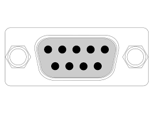
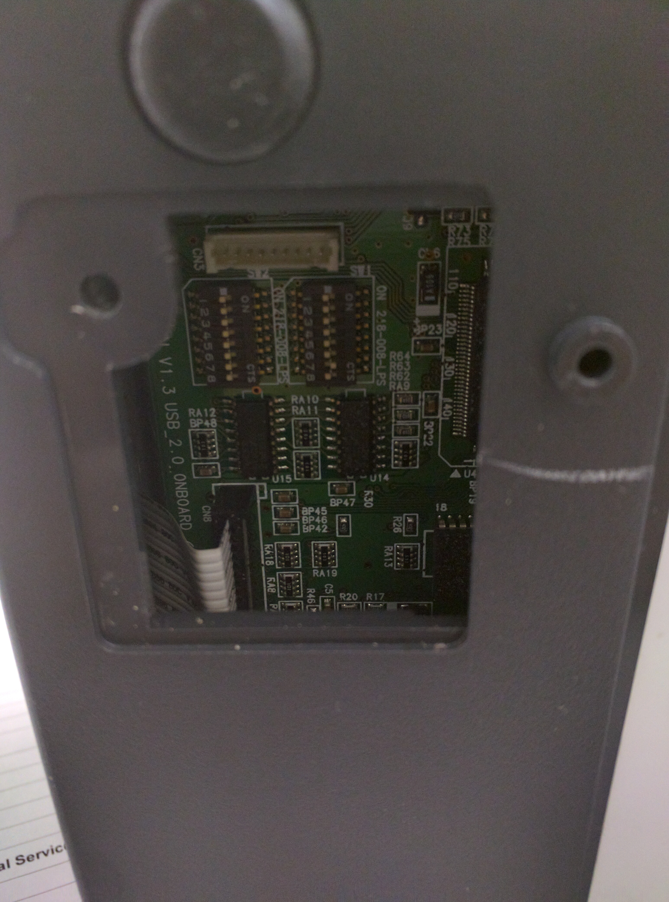

Serial Printers
============

Getting the printer object::

    from escpos.connections import getSerialPrinter

    printer = getSerialPrinter()(dev='/dev/ttyS0',
                              baudrate=9600,
                              bytesize=8,
                              parity=serial.PARITY_NONE,
                              stopbits=serial.STOPBITS_ONE,
                              timeout=1.00,
                              dsrdtr=True)

    printer.text("Hello World")
    printer.lf()

As you can see there are a few params that you can pass to the printer object. In most cases you can ignore most of
these params other than **dev** and **baudrate** which tend to vary from printer to printer. To check your serial port
number look for the device file that pops up in /dev folder when you connect your printer to the computer. Baudrate
setting can vary based on your printer model. Some models even allow you to set specific jumpers to change the baudrate
for your printer. You must ensure that your serial port likes to talk at the baudrate you are setting your printer to.

The jumpers for changing the baudrate can be accessed on some printers by unscrewing a small plate at the bottom like
this

Creating the printer object
---------------------------
::

  from escpos.connections import getSerialPrinter

  printer = getSerialPrinter()(dev='/dev/ttyS0',
                            baudrate=9600)

  printer.text("Hello World")
  printer.lf()
